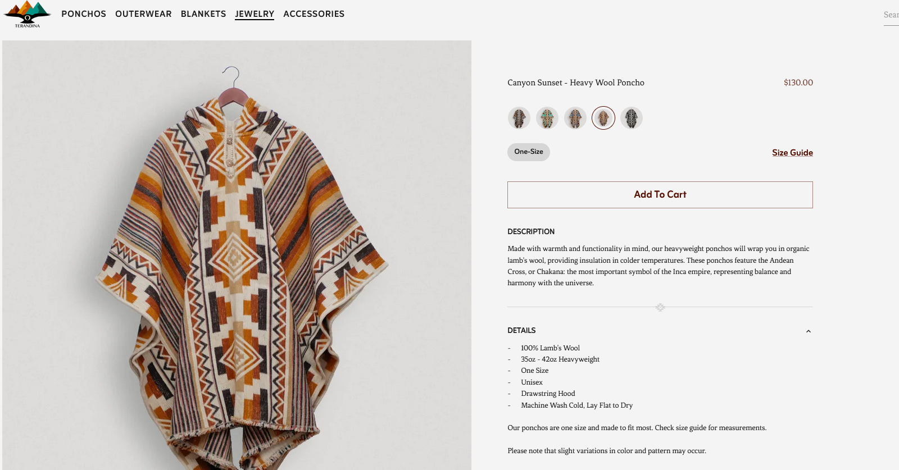
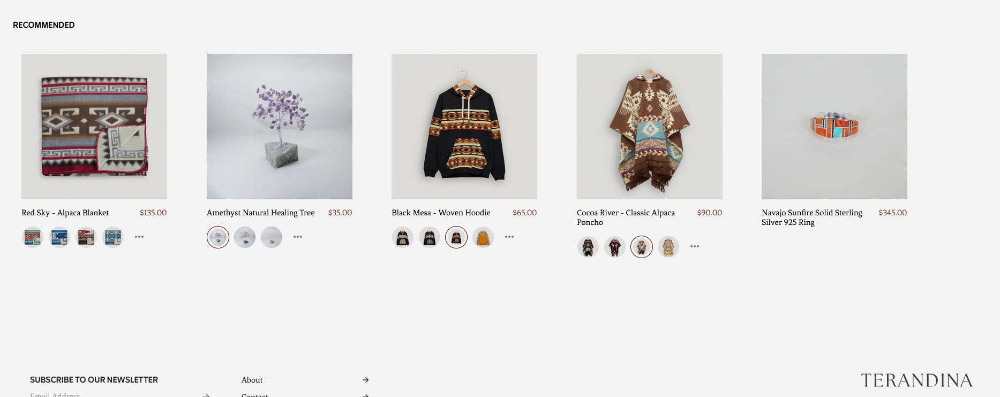
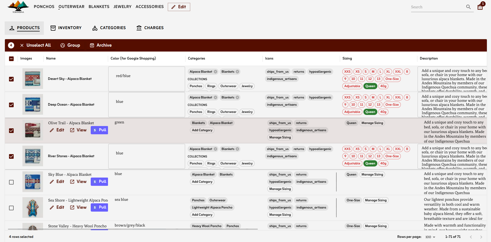
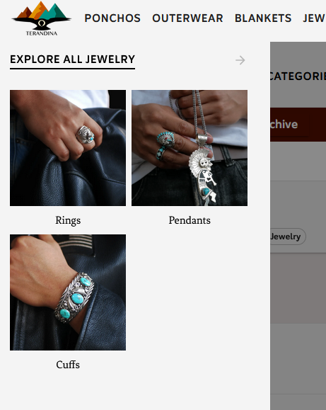
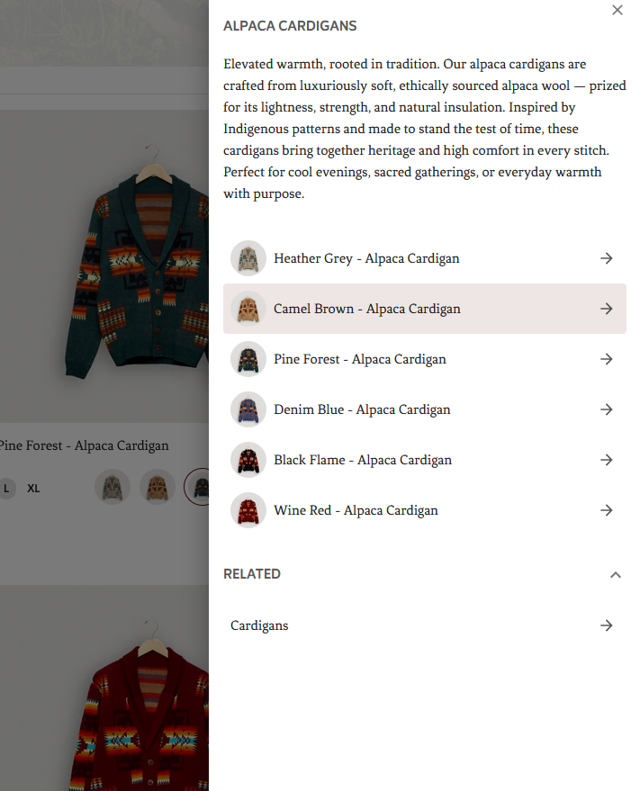
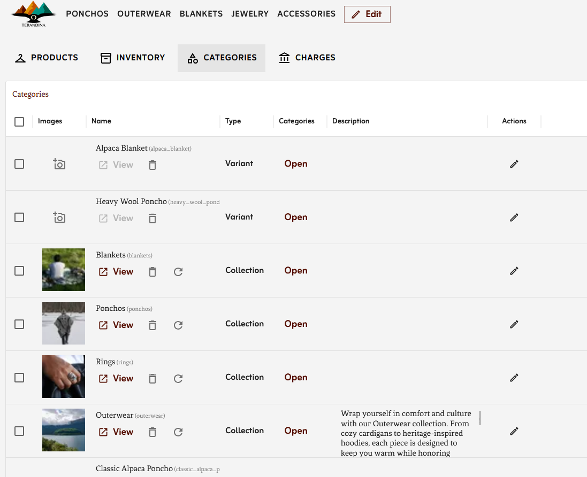
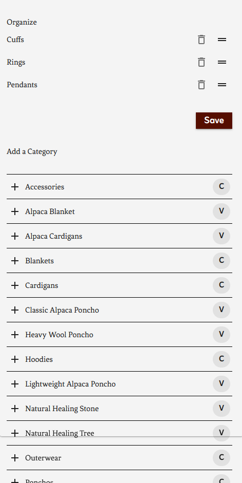
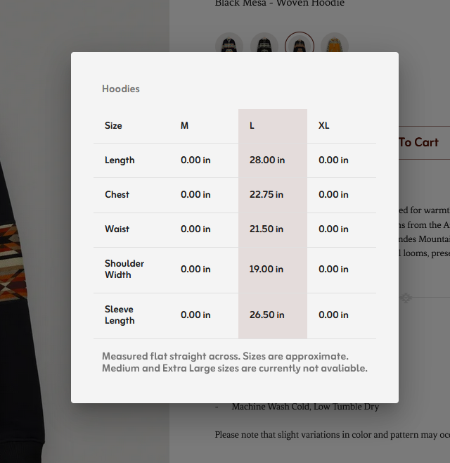
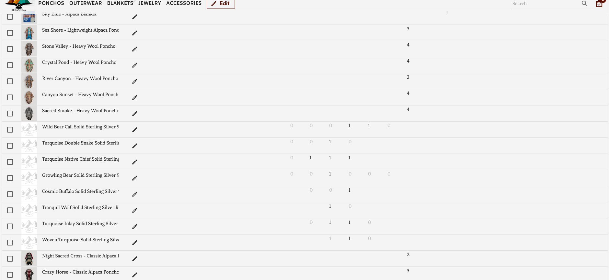

## Terandina LLC
Express yourself freely with authentic native outerwear, jewelry, and accessories from Terandina at terandina.com.

Terandina.com is an e-commerce web application powered by React/NextJS, with a custom content management system(CMS) using Stripe for secure payments, Upload Thing for storage, and Vercel/AWS for cloud deployment.

## Features for business management

Below is an insider look at the administrative panel for the website where managers can add product names and descriptions. <b>Most editing tasks can be completed and changed without reload.</b>

- Prices are pulled directly off Stripe.
- Select categories and variant by the product.
- Select/deselect icons to show with a product e.g. hypoalergenic.
- Toggle on and off sizes.
- Featured checkbox places the product on the home page.
- Products can also be hidden, not removed from the site.

### Authentication
- Signed in business managers hold a client-side cookie in browser storage that persists state across reloads and sessions. Erasing browser cookies signs a user out.
- Registration of new users is disabled in production.
- Cookies last about 1 week before expiring.
- Backups exists of all products in case of attack or erasure.
- Stripe's edit transaction history features provides key insights on when and how changes were made throughout any given day. 

### Integration with Stripe

- Products added initially from the Stripe Dashboard, ping the website by webhook to create a new public listing.
- Product updates send back the least amount of data to functionally process payments.
- Stripe handles PCI compliance and tax calculations by customer address.
- Purchases are secure. Purchases are individually processed through a single source of truth. After the customer proceeds to payment, a payment intent amount or items cannot be altered unless this option is selected. Interception of payment details to alter amount, items, or purchasing details results in a failed transaction/cancelled order.

### Images with Upload Thing

- Images are stored in three seperate versions:
  - Small: 70px wide or tall at most, square. Used for small icons, hints, or product indicators that display as large as a thumb print.
  - Medium: 500px wide or tall at most. This compressed size is used for splash screens with a large amount of items which can be hard to load all at once.
  - Large/Authentic upload size: The original intended quality. Used for single product pages to showcase products and previews most perfectly.

### Categories

- Managers can create new product groupings as variants/collections.
- Only collections, not variants get their own dedicated pages.
- Variants are shown as alternative options on the individual products pages.
- Any grouping can have one/many cover photos.
 
### Search
- The product search page is statically generated for better searching speed and computational efficiency.
- Revalidation occurs when at least one product is edited.
- [ ] Sorting and filtering of items on the sidebar.

### Inventory & Sizing

- Sizes are hardcoded by collection.
- The currently selected size is highlighted in the size indicator.

- The editor provides a table of inventory options including In Stock by quantity, out of stock, or unavaliable.
- [ ] Sizes are not custom. Allow managers to add custom sizes. 

### Google Shopping Integration
- In test mode, the site can reproduce an rss feed of products for Google Merchant Center to injest.
- This rss feed is accessible publically in a permenant static state.
- [ ] Allow static-revalidation in production of the RSS feed.

### TODOs
- [ ] Upgrade to Payload CMS