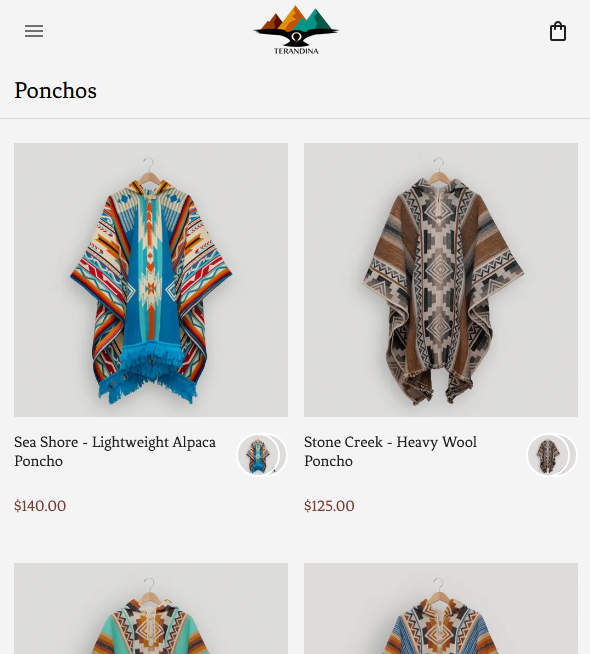

## Terandina
Statically-generated NextJS e-commerce application using Stripe and Upload Thing, deployed on Vercel.

### Integration with Stripe
- Adding a product, price automatically uploads onto the site using webhooks.
- Product updates send back the least amount of data to functionally process payments.

### Images with Upload Thing
- Images downloaded off Stripe are reuploaded to Upload Thing.
- Images are broken into 3 versions: small, medium, and large file sizes.
- Converted to Webp format.

### Collections
- Products have no limit on how many collections, tags, or variants they can be apart of.
- Offers 3 types of collections: "Collection", "Tag", or "Variants"
- Collections offer a broad-surface level seperation of products.
- Tags work across many collections to collect common consumer needs e.g. "Men's" or "Women's" specific products.
- Variants are specific groups of easily-swapable elements.

### Sizing
- Editors can choose between a size being shown, out of stock, or avaliable.

